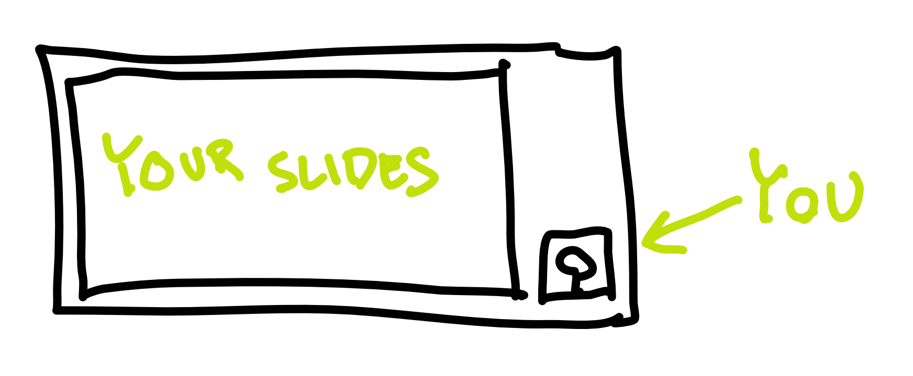
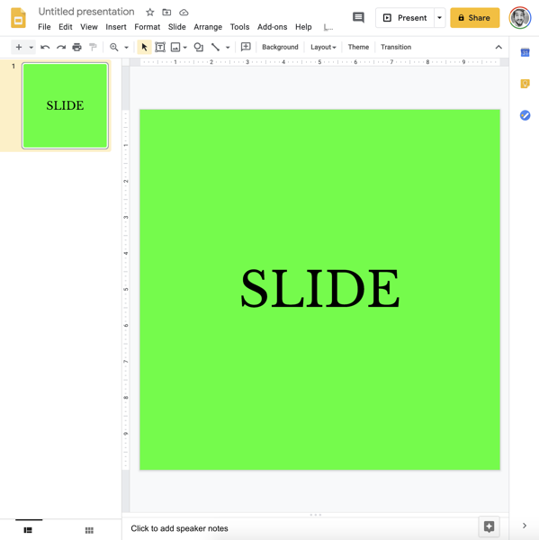
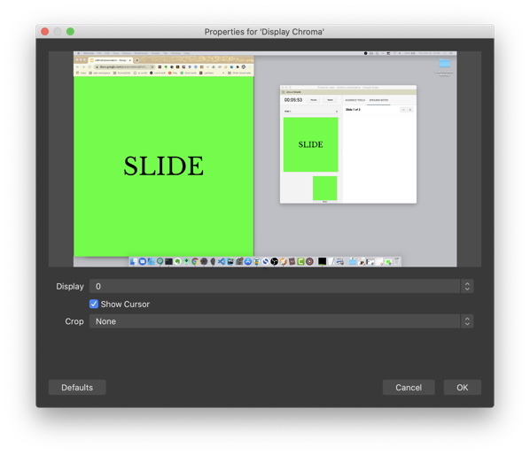
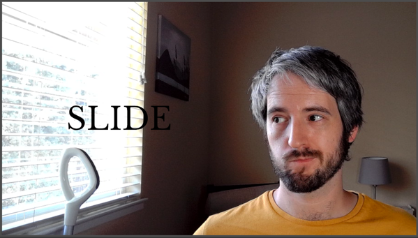

In 2020, if you’re giving a tech talk, chances are it’s not in person.
You’re using something like Zoom, Hangouts, Skype, YouTube or
StreamYard. This is generally a good thing: it allows others to learn
from you despite a raging pandemic, and it also makes it easier for
people in remote places to participate.

But it has obvious downsides: audio/video issues, awkward interactions,
and internet connection failures. In this blog post, I’d like to focus
on one additional, often overlooked downside: the difficulty to maintain
attention.

## Driving into the future using only our rearview mirror

A typical person’s view of a tech talk these days is this:

A huge space taken by the presentation, and a small rectangle containing
you, the speaker.

This is great if you have a lot of writing on your slides – people can
read it better. But, here’s the thing: you should almost *never* have
lots of writing on your slides. Slides are not the messenger, *you* are.
Slides are auxiliary. They should contain a phrase, a tiny piece of
code, a simple diagram, a graph, or a picture. Something the audience
can fully comprehend in two seconds. Otherwise, the audience will be
trying to comprehend the slides while you talk, which will make them
miss parts of what you’re saying. If this goes for long enough, you will
lose them as an audience. At that point, you’re better of just sending
them the slides to read on their own.

Let’s also address the fact that you’re a small rectangle tucked away
next to your humongous slides. It’s really hard to maintain attention
looking at a static slide. It’s much easier to maintain attention
looking at a *person*. We’re humans. That’s what our brains do. They
read other people’s faces. We can’t help being mildly entertained
looking at another person’s face (assuming it’s reasonably animated).

So, basically, the current setup of online presentations is terrible.

But we can’t blame the aforementioned virtual meeting services (Zoom
etc.) for this. The problem is with our presentations.

Up until now, it made perfect sense to have presentations take up the
whole area of an average screen. This is because presentations were
given in person, so the only thing on the screen was the presentation,
and the speaker was next to the screen.

For this reason, most presentation software (Powerpoint, Slides,
Keynote) defaults to 16:9 aspect ratio for slides (4:3 in the old days).

Now that the screen must be *shared* between the speaker and her slides,
that same aspect ratio is no longer a good idea. Here are some
configurations of a sitting speaker and her presentation, as seen on
someone’s monitor through YouTube or Zoom.

None of the configurations is ideal. Either the presenter is tiny, or
the presenter is overlapping their own slides, or the presentation is
too small. In almost all cases, much of the screen real estate is just
padding, and the human face is way too small to hold attention.

Said with Marshal McLuhan, we “drive into the future using only our
rearview mirror”. We have all this technology but we’re using it the way
it was used in the past. This is a time ripe for innovation.

## The ideal remote presentation

As a member of the audience, I want to have something to latch on when
seeing a remote presentation. A mostly-static slide deck is not it. A
miniature of the speaker is not it. Lot’s of padding — not it.

How about seeing the presenter full screen? If she needs to show some
auxiliary content (live coding, short texts, diagrams), why not overlay
it on top of her webcam view?

This is what my setup is all about. It is also close to what the people
at [mmhmm.app](https://www.mmhmm.app/) seem to be going for, so if any
of the following seems a bit too much and you’re not in a hurry, you may
want to just wait until they have a public product. (Full disclosure: I
don’t have access to their software, so I’m only guessing what they’re
going for through their marketing content. Most of it seems a bit
gimmicky but I assume that’s just noise that will later be filtered
out.)

## The basics

Before I start talking about boring stuff like chroma key settings in
OBS, I want to give an overview. That way, even people who couldn’t care
less about actually implementing this stuff on their end can see the
idea.

We start by making our slides way narrower than the default. Every
presentation program lets you set up the size or aspect ratio of your
slides. If your slides are more custom (an HTML presentation, a custom
app, etc.), you probably have it even easier: just resize the window.

I’m going with 1:1. In other words, square. This is, to be honest,
completely arbitrary. I could have gone with 1:1.2 or 1.5:1. Maybe I
will in the future. I guess, for now, a square is just easier to reason
about.

I’ve found that the narrower slide makes me think more about what to put
on it. In other words, I’m less likely to put a bunch of random ideas on
a slide. I think it makes the presentation more crisp.

I could end here and just have a 1:1 presentation on the left, and the
rest of the screen filled with my face. Like this:

But I’ve found that doesn’t really cut it. The two sections of the
screen are not a pleasing look, especially when they’re part of an
already-tiled screen (such as a Zoom meeting).

So I go a step furter, and *overlay* the contents of the slide. I use
the oldest trick in TV: greenscreen. My slides have a green background,
and my streaming software is set up to make the green parts of the
slides transparent. To make the whole thing a tiny bit nicer and
readable, I also introduce a subtle white gradient behind the slides.
This gradient co-incides with my window, so it looks natural.

And boom:

## How to do it

All of the following assumes you have a reasonably fast computer. Video
conferencing in general is quite computationally intensive. (Ask my
previous computer, a high-end MacBook Pro with some hardware cooling
issue, which routinely went to single-digit FPS because of a simple
video call.) The additional processing is yet another layer of CPU load,
so think about that.

I’m going to describe (and screenshot) my [OBS](https://obsproject.com/)
setup on MacOS, but it should be easy enough to translate all of this to
other streaming software and other operating systems.

### Step 1: Narrower slides

This was discussed before. In Google Slides, this is a setting in File
&gt; Page Setup.

### Step 2: Green background

Go to you slide software and change the background of the master slide
to pure green (hex `#00FF00`).

Alternatively, do something similar with your custom presentation
software or even your IDE. Whatever you want transparent, make it green.

### Step 3: Create a new scene

In OBS, this is as simple as clicking the `+` in the scene list, and
naming it.

### Step 4: Add webcam input

Add your webcam input (“Video Capture Device”) as a source. It’s
important that your webcome is close to where you’ll be looking when
presenting. For example, if you have two monitors, place the webcam on
top of the monitor that will be your primary when presenting.

Fill the scene with the webcam video, but try to position yourself so
that you’re to the side. Remember, you need some room for the slides.
We’re trying to keep your face visible all the time, but it doesn’t need
to be the centerpiece of your stream.

### Step 5: Add screencast

In OBS, this is called “Display Capture”. This lets you share your
screen. I recommend sharing the screen instead of sharing a single
window, because it’s more versatile. If you only share a single window
(“Window Capture” in OBS), you can’t just pop over some small dialog
that you want to show to the audience. Crucially, at least on a Mac,
sharing a window also gets much lower framerates than sharing the whole
screen.

You’ll want to crop that screencast so that it only shows the area your
slides fill.

### Step 6: Apply chroma key

Tap on the new “Display Capture” source and push “Filters”. Add a new
“Chroma Key” filter.

Chroma key is a fancy name for “removing pixels of a certain color”.
Chroma means “purity or intensity of color”. Impure green won’t be
transparent, but pure green will. This is exactly what they’ve been
using in film and television for decades.

As an aside, you could also use “Color Key” or “Luma Key”, but I’ve
found “Chroma Key” to be best and most idiot-proof.

You can play around with the settings on the filter until you’re happy.
I think the default settings are decent. I think I fiddled a bit with
the “Smoothness” and “Spill Reduction” settings. Play it by ear.

### Step 7: Add a gradient

Create a gradient in your favorite image editing software. Your goal is
to have a PNG file that is filled with a single color (white, black, or
whatever else you want), and gradually goes from fully (or almost fully)
opaque on one side to fully transparent at about two thirds of the
width.

Put this PNG file as an image between the “Display Capture” and the
webcam input.

The idea is not to be too on-the-nose about it, but still increase
legibility of your content.

### Step 8: Use it

If you’re streaming to YouTube or Twitch, you’re already done. Your
streaming software (e.g. OBS) can just send the stuff to the streaming
service’s ingestion server.

If you want to use this setup in Zoom, Meet, StreamYard, Skype, and
similar webcam-only software, you need to make your operating system
think that your streaming software is a webcam. Thankfully, this is easy
in OBS. You download and install a plugin called [OBS
Virtualcam](https://obsproject.com/forum/resources/obs-virtualcam.949/)
([Mac
version](https://github.com/johnboiles/obs-mac-virtualcam/releases)),
restart OBS, and start the virtual webcam using Tools &gt; Start Virtual
Camera.

Next, you might need to restart your meeting software (Zoom, Skype, or
the browser that runs Meet or StreamYard), but after that, you’re set.
The webcam settings now have a new camera called something like “OBS”,
and that’s the output from OBS with all those setting we just did.

Congrats, you’re done! Enjoy giving more engaging presentations.
